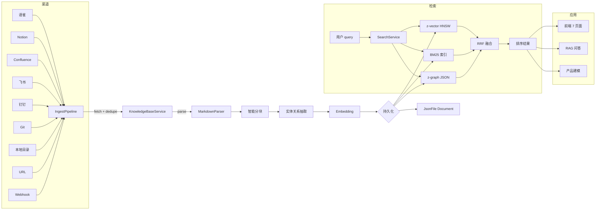
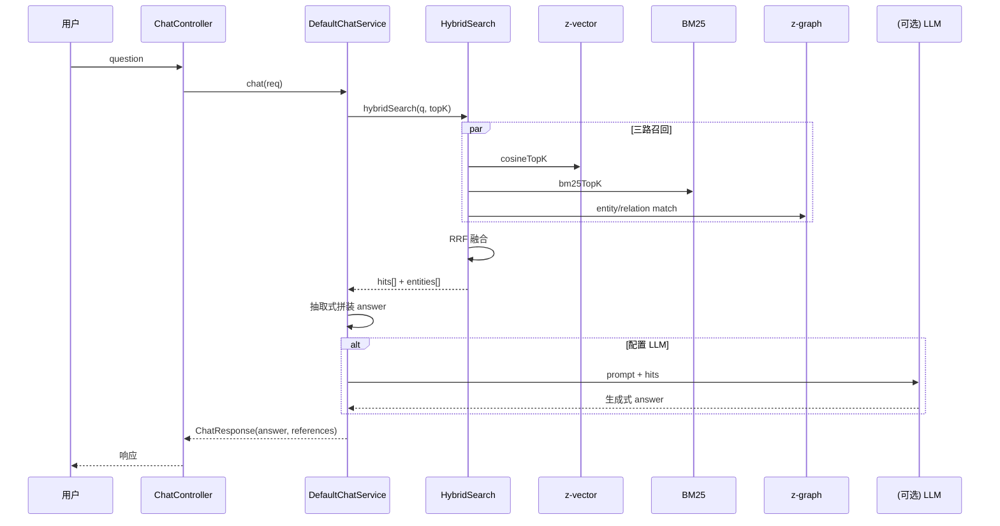

# z-kb

> **自研产品级知识库系统** — 对标 LightRAG + BookStack/Mindoc + RAGFlow + Anything-LLM 的融合形态

## 一句话定位

z-kb 是一个 **Java 17 + Spring Boot 2.7.18 + z-vector(向量库) + z-graph(图数据库) + z-util(工具集)** 的产品级知识库系统。具备：

- 📚 **多渠道文档接入**（语雀/Notion/Confluence/飞书/钉钉/Git/本地目录/URL/Webhook）
- 🔍 **混合检索**（BM25 + 向量 + 图谱融合，RRF 重排序）
- 🧠 **GraphRAG 问答**（实体/关系抽取 + 因果链推理）
- 🤖 **产品逻辑建模**（拆解 + Cheat Sheet 小抄自动生成）
- 💾 **持久化 & 弹性恢复**（JSON 文件 + 启动时索引重建）
- 🌐 **可视化图谱 & 7 页面控制台**（React + Vite + AntD）

## 📑 目录

1. [设计融合](#设计融合)
2. [系统架构](#系统架构)
3. [目录结构](#目录结构)
4. [核心能力清单](#核心能力清单)
5. [快速开始](#快速开始)
6. [数据接入详细配置](#数据接入详细配置)
7. [Embedding Provider 切换](#embedding-provider-切换)
8. [完整 REST API 索引](#完整-rest-api-索引)
9. [关键算法说明](#关键算法说明)
10. [持久化设计](#持久化设计)
11. [从 JSON 迁移到 MySQL](#从-json-迁移到-mysql)
12. [压测表现（实测）](#压测表现实测)
13. [FAQ & 常见问题](#faq--常见问题)
14. [版本历史](#版本历史)
15. [贡献指南](#贡献指南)

---

## 设计融合

| 参考项目 | 复用能力 | 关键参考点 |
|---|---|---|
| **LightRAG / GraphRAG** | 实体/关系抽取、图谱融合检索 | entity+relation 抽取流程、GraphRAG 子图查询 |
| **RAGFlow** | 深度文档理解、智能分块、多路召回 | 标题感知分块、RRF 重排序 |
| **Anything-LLM** | 工作台/会话管理、引用追踪、多知识库隔离 | Workspace 概念、引用源标注 |
| **BookStack / Mindoc** | 文档树、Markdown 导入导出、版本快照 | 树状结构、Markdown 双向链接 |
| **Obsidian / Logseq** | 双向链接 `[[wikilink]]`、标签系统、知识图谱 | `[[wikilink]]` 解析、标签云 |
| **SiYuan** | 块级（Block）管理、数据库视图 | chunk 化、heading path |

---

## 系统架构

### 数据流图



### RAG 问答链路



---

## 目录结构

```
z-opc-foundation/z-kb/
├── pom.xml                                # 父 POM（管理 12 个模块）
├── README.md                              # 本文档
│
├── z-kb-api/                              # 公共接口与数据模型（POJO + Service 接口）
│   └── src/main/java/com/zifang/z/kb/api/
│       ├── Document.java                  # 文档实体
│       ├── Chunk.java                     # 文本块
│       ├── Entity.java + EntityType.java  # 知识图谱实体（5 类）
│       ├── Relation.java                  # 关系（含 CAUSES/ENABLES/REQUIRES/PRODUCES/TRIGGERS）
│       ├── Workspace.java                 # 工作台（多租户隔离单元）
│       ├── IndexRequest.java              # 索引请求
│       ├── ImportResult.java              # 导入结果
│       ├── SearchQuery.java + SearchResult.java
│       ├── ChatRequest.java + ChatResponse.java + ChatSession.java
│       ├── GraphQueryResult.java          # 图谱子图结果
│       ├── KBStatistics.java              # 工作台统计
│       └── KnowledgeBaseService.java      # 服务接口
│
├── z-kb-core/                             # 核心引擎（4 个子模块）
│   ├── parser/                            # Markdown 解析
│   │   ├── MarkdownParser.java            # frontmatter + 标题 + 代码块 + 表格
│   │   └── WikilinkExtractor.java         # [[wikilink]] 抽取
│   ├── chunker/                           # 智能分块
│   │   ├── Chunker.java                   # 标题感知 + Token 预算
│   │   └── Chunk.java (extends api.Chunk)
│   ├── extractor/                         # 实体/关系抽取
│   │   ├── EntityExtractor.java           # 规则 + 共现窗口
│   │   └── RelationExtractor.java         # 同上
│   ├── embedding/                         # Embedding 抽象
│   │   ├── EmbeddingProvider.java         # 接口
│   │   ├── TfIdfEmbeddingProvider.java    # 本地实现（512 维）
│   │   └── HttpEmbeddingProvider.java     # 远程实现（OpenAI/Qwen/GLM）
│   └── search/                            # 混合检索
│       ├── HybridSearcher.java            # RRF 三路融合
│       ├── Bm25Searcher.java              # BM25 全文索引
│       └── ChunkVectorStore.java          # 向量检索接口
│
├── z-kb-vector/                           # 向量检索适配（封装 z-vector）
├── z-kb-graph/                            # 图谱适配（封装 z-graph，JSON 持久化）
├── z-kb-storage/                          # 元数据存储（JsonFile + MyBatis-Plus 兼容）
├── z-kb-protocol/                         # OpenAPI 3.0 + DTO
├── z-kb-spring-boot-starter/              # Spring Boot 自动装配
├── z-kb-ingest/                           # 多渠道接入管道（9 种数据源）
│   ├── DataSource.java                    # 数据源接口
│   ├── IngestPipeline.java                # 编排 fetch → normalize → dedupe → index
│   ├── IngestRequest.java + IngestResult.java
│   ├── DataSourceRegistry.java            # 数据源注册表
│   ├── IngestAutoConfiguration.java       # 自动装配
│   └── source/                            # 9 个内置数据源
│       ├── LocalDirSource.java            # 本地目录
│       ├── YuqueSource.java               # 语雀（HTTP API）
│       ├── NotionSource.java              # Notion
│       ├── ConfluenceSource.java          # Confluence
│       ├── FeishuSource.java              # 飞书
│       ├── DingtalkSource.java            # 钉钉
│       ├── GitSource.java                 # Git 仓库
│       ├── UrlSource.java                 # URL 抓取
│       └── WebhookSource.java             # Webhook 接收
│
├── z-kb-modeling/                         # 产品逻辑建模
│   ├── core/ModelingService.java          # 拆解服务
│   ├── model/                             # 数据模型
│   │   ├── ProductModel.java              # 产品模型
│   │   ├── CausalLink.java                # 因果链
│   │   ├── DataFlowStep.java              # 数据流步骤
│   │   └── CheatSheet.java                # 小抄（含 Markdown）
│   ├── ProductDecomposer.java             # 从图谱拆解产品
│   ├── CausalChainExtractor.java          # 因果链抽取
│   └── CheatSheetGenerator.java           # 小抄渲染（含 mermaid）
│
├── z-kb-web/                              # REST API（7 个 Controller）
│   └── controller/
│       ├── DocumentController.java        # /api/kb/documents
│       ├── SearchController.java         # /api/kb/search
│       ├── ChatController.java            # /api/kb/chat
│       ├── GraphController.java           # /api/kb/graph
│       ├── WorkspaceController.java       # /api/kb/workspaces
│       ├── IngestController.java          # /api/kb/ingest
│       └── ModelingController.java        # /api/kb/modeling
│
├── z-kb-bootstrap/                        # 启动器
│   └── src/main/java/com/zifang/z/kb/bootstrap/
│       └── BootstrapApplication.java      # @SpringBootApplication
│
└── z-kb-frontend/                         # 前端（独立工程）
    ├── package.json
    ├── vite.config.ts
    ├── tsconfig.json
    └── src/
        ├── main.tsx                       # 入口（含 BrowserRouter 修复）
        ├── App.tsx                        # 侧边栏布局 + 路由
        ├── pages/
        │   ├── Dashboard.tsx              # 仪表板
        │   ├── Documents.tsx              # 文档管理
        │   ├── DataSources.tsx            # 数据接入
        │   ├── ModelingPage.tsx           # 产品建模
        │   ├── SearchPage.tsx             # 检索
        │   ├── GraphPage.tsx              # 知识图谱
        │   └── ChatPage.tsx               # RAG 问答
        ├── services/api.ts                # 后端 API 客户端（含慢请求实例）
        └── types/                         # TypeScript 类型定义
```

---

## 核心能力清单

| 能力 | 状态 | 说明 |
|---|---|---|
| **Markdown 导入** | ✅ | frontmatter (yuque/obsidian 兼容) + wikilink `[[]]` + 标签 |
| **智能分块** | ✅ | 标题感知（H1/H2/H3）+ Token 预算（默认 512 token/chunk） |
| **Embedding** | ✅ | TF-IDF 本地（512 维）+ HTTP 远程（OpenAI/Qwen/GLM 接口已抽象） |
| **向量检索** | ✅ | 基于 z-vector HNSW 索引 |
| **全文检索** | ✅ | BM25（TF-IDF 衍生） |
| **实体关系抽取** | ✅ | 规则 + 共现窗口，5 类实体（CONCEPT/TECHNOLOGY/TOOL/DATABASE/PERSON） |
| **图谱检索** | ✅ | 基于 z-graph，多跳遍历、子图查询 |
| **混合检索** | ✅ | RRF 三路召回，可调权重 |
| **GraphRAG 问答** | ✅ | 实体-关系-块三元组联合检索 + 抽取式回答（可接 LLM） |
| **多渠道接入** | ✅ | 9 种数据源：语雀、Notion、Confluence、飞书、钉钉、Git、本地目录、URL、Webhook |
| **产品建模** | ✅ | 拆解 + 因果链抽取 + Markdown 小抄自动生成（带 mermaid 流程图） |
| **持久化** | ✅ | JSON 文件，重启不丢数据 + 自动重建索引（向量+BM25） |
| **REST API** | ✅ | Knife4j 文档 `/swagger-ui.html` + 业务 API |
| **工作台 / 会话** | ✅ | 多工作台隔离 + RAG 会话管理 |
| **前端 UI** | ✅ | 7 个页面（仪表板/文档/接入/建模/检索/图谱/问答） |
| **图谱可视化** | ✅ | D3 力导向图，节点按类型彩色区分 |

---

## 快速开始

### 1. 准备依赖（z-vector + z-graph）

```bash
cd /Users/zifang/workplace/ceo_workplace/z-opc-foundation/z-vector
mvn install -DskipTests

cd /Users/zifang/workplace/ceo_workplace/z-opc-foundation/z-graph
mvn install -DskipTests
```

### 2. 构建 z-kb

```bash
cd /Users/zifang/workplace/ceo_workplace/z-opc-foundation/z-kb
mvn clean install -DskipTests
```

> 第一次构建预计 30-60 秒（12 个模块）。

### 3. 启动后端（默认 `:8080`）

```bash
cd z-kb-bootstrap
java -jar target/z-kb-bootstrap-1.0.0-SNAPSHOT.jar
# 或后台运行
nohup java -Xmx2g -jar target/z-kb-bootstrap-1.0.0-SNAPSHOT.jar > /tmp/zkb.log 2>&1 &
```

### 4. 启动前端（默认 `:5173`）

```bash
cd z-kb-frontend
npm install
npm run dev
```

### 5. 浏览器访问

| 地址 | 说明 |
|---|---|
| http://localhost:5173 | 前端 UI（7 个页面） |
| http://localhost:8080/swagger-ui.html | Swagger API 文档 |
| http://localhost:8080/actuator/health | 健康检查 |

### 6. 一键导入测试数据（可选）

打开浏览器 → 「数据接入」页面 → 点击「本地目录」旁的接入 → 配置路径：

```
path: /Users/zifang/workplace/ceo_workplace/z-biz-creator/z-biz-learning-yuque-loc/yuque/开发分类/001_计算机基础
recursive: true
limit: 500
```

点击「接入」即可批量导入 314 篇文档。

---

## 数据接入详细配置

z-kb 内置 9 种数据源，每种都通过统一的 `IngestPipeline` 编排：

### 1. 本地目录（local-default）

```bash
curl -X POST 'http://localhost:8080/api/kb/ingest/run?sourceId=local-default' \
  -H "Content-Type: application/json" \
  -d '{
    "path": "/path/to/markdown",
    "recursive": true,
    "limit": 500,
    "workspace": "default"
  }'
```

- **支持格式**：`.md` / `.markdown`
- **跳过规则**：以 `.` 或 `_` 开头的目录（Obsidian 习惯）
- **幂等 ID**：`local:<相对路径>`（同名文件多次 ingest 自动跳过）

### 2. 语雀（yuque-default）

```bash
curl -X POST 'http://localhost:8080/api/kb/ingest/run?sourceId=yuque-default' \
  -H "Content-Type: application/json" \
  -d '{
    "token": "<your-yuque-token>",
    "namespace": "<group-or-user>",
    "workspace": "default"
  }'
```

- 自动识别 `yuque_slug` / `yuque_url` frontmatter 字段
- 抓取整个知识库下所有文档

### 3. Notion（notion-default）

```bash
curl -X POST 'http://localhost:8080/api/kb/ingest/run?sourceId=notion-default' \
  -H "Content-Type: application/json" \
  -d '{
    "integrationToken": "<notion-integration-secret>",
    "databaseId": "<database-id-or-page-id>",
    "workspace": "default"
  }'
```

### 4. Confluence（confluence-default）

```bash
{
  "baseUrl": "https://your-domain.atlassian.net/wiki",
  "username": "<email>",
  "apiToken": "<api-token>",
  "spaceKey": "<SPACE>",
  "workspace": "default"
}
```

### 5. 飞书（feishu-default）

```bash
{
  "appId": "<feishu-app-id>",
  "appSecret": "<feishu-app-secret>",
  "folderToken": "<folder-token>",
  "workspace": "default"
}
```

### 6. 钉钉文档（dingtalk-default）

```bash
{
  "appKey": "<dingtalk-app-key>",
  "appSecret": "<dingtalk-app-secret>",
  "workspace": "default"
}
```

### 7. Git 仓库（git-default）

```bash
{
  "repoUrl": "https://github.com/<owner>/<repo>",
  "branch": "main",
  "pathFilter": "docs/**/*.md",
  "workspace": "default"
}
```

### 8. URL 抓取（url-default）

```bash
{
  "url": "https://example.com/article.md",
  "workspace": "default"
}
```

### 9. Webhook（webhook-default）

```bash
# 接收 webhook 文档
curl -X POST 'http://localhost:8080/api/kb/ingest/webhook' \
  -H "Content-Type: application/json" \
  -d '{
    "title": "推送的文档",
    "content": "# 内容...",
    "metadata": {"source": "feishu-bot"}
  }'

# 批量入库（从 webhook 缓冲）
curl -X POST 'http://localhost:8080/api/kb/ingest/webhook/flush'
```

---

## Embedding Provider 切换

z-kb 默认使用 `TfIdfEmbeddingProvider`（本地、无依赖），生产场景建议切换到远程 Embedding。

### 切换到 OpenAI

在 `z-kb-spring-boot-starter` 的 application.yml：

```yaml
zkb:
  embedding:
    provider: http-openai   # 覆盖默认 tfidf-local
    api-key: sk-xxx
    base-url: https://api.openai.com/v1
    model: text-embedding-3-small
    dimension: 1536
```

### 切换到 通义千问 DashScope

```yaml
zkb:
  embedding:
    provider: http-qwen
    api-key: sk-xxx
    base-url: https://dashscope.aliyuncs.com/api/v1
    model: text-embedding-v3
    dimension: 1024
```

### 自定义 HTTP Embedding

实现 `EmbeddingProvider` 接口并注册为 Spring Bean：

```java
@Bean
public EmbeddingProvider customEmbedding() {
    return new HttpEmbeddingProvider(
        "https://your-api.com/v1/embeddings",
        "your-api-key",
        "your-model-name",
        1024  // dimension
    );
}
```

> **重要**：切换 Provider 后必须 `deleteByDocument` 旧 chunks + 重新 ingest，或全量重建索引（删除 `~/.zkb/zkb.json` 后重启）。

---

## 完整 REST API 索引

所有 API 路径前缀：`/api/kb`，Swagger 文档：`/swagger-ui.html`

### 文档管理

| 方法 | 路径 | 说明 |
|---|---|---|
| POST | `/documents` | 索引单篇文档 |
| POST | `/documents/batch` | 批量索引 |
| POST | `/documents/markdown` | 导入 Markdown 文本 |
| GET | `/documents/{workspace}/{id}` | 查询文档 |
| DELETE | `/documents/{workspace}/{id}` | 删除文档 |
| GET | `/documents/{workspace}` | 列出文档（分页） |
| GET | `/documents/{workspace}/by-tags` | 按标签筛选 |
| POST | `/documents/{workspace}/{id}/reindex` | 重建索引 |
| GET | `/documents/{workspace}/count` | 统计数量 |

### 检索

| 方法 | 路径 | 说明 |
|---|---|---|
| POST | `/search` | 混合检索（RRF） |

请求体：`{ query, topK, workspace, mode: FUSION/VECTOR/KEYWORD/GRAPH, vectorWeight, keywordWeight, graphWeight }`

### 知识图谱

| 方法 | 路径 | 说明 |
|---|---|---|
| GET | `/graph/{workspace}/entities` | 列出实体 |
| GET | `/graph/{workspace}/entities/{name}` | 按名称查询 |
| GET | `/graph/{workspace}/entities/{name}/neighbors` | 多跳邻居 |
| POST | `/graph/{workspace}/subgraph` | 子图查询 |

### RAG 问答

| 方法 | 路径 | 说明 |
|---|---|---|
| POST | `/chat` | 单轮问答 |
| POST | `/chat/sessions` | 创建会话 |
| GET | `/chat/sessions/{id}` | 获取会话 |
| GET | `/chat/sessions` | 列出会话 |
| DELETE | `/chat/sessions/{id}` | 删除会话 |
| POST | `/chat/sessions/{id}/chat` | 会话内问答 |

### 工作台

| 方法 | 路径 | 说明 |
|---|---|---|
| POST | `/workspaces` | 创建工作台 |
| GET | `/workspaces/{name}` | 按名称查询 |
| GET | `/workspaces` | 列出所有工作台 |
| GET | `/workspaces/{name}/statistics` | 综合统计 |

### 数据接入

| 方法 | 路径 | 说明 |
|---|---|---|
| GET | `/ingest/sources` | 列出已注册数据源 |
| POST | `/ingest/run?sourceId=X` | 按数据源触发拉取 |
| POST | `/ingest/submit` | 提交 IngestRequest 列表 |
| POST | `/ingest/webhook` | Webhook 接收文档 |
| POST | `/ingest/webhook/flush` | 拉取 Webhook 缓冲入库 |
| GET | `/ingest/stats` | 累计统计 |

### 产品建模

| 方法 | 路径 | 说明 |
|---|---|---|
| GET | `/modeling/decompose?workspace=X` | 拆解为产品模型 |
| GET | `/modeling/cheatsheet?workspace=X` | 一站式拆解 + 小抄 |
| POST | `/modeling/cheatsheet` | 基于已有模型渲染小抄 |

---

## 关键算法说明

### 1. 智能分块（标题感知 + Token 预算）

```java
Chunker.chunk(doc) → List<Chunk>
```

- 按 H1/H2/H3 切分大段落，每个 chunk 最多 512 token
- 块间重叠 80 token（保留上下文连贯性）
- 每个 chunk 带 `headingPath`（如 `["H1: TCP协议", "H2: 握手过程"]`）

### 2. 实体/关系抽取（规则 + 共现窗口）

```java
EntityExtractor.extract(chunk) → List<Entity>
RelationExtractor.extract(chunk, entities) → List<Relation>
```

- **规则匹配**：预定义实体词典（人名/工具名/技术名）
- **共现窗口**：同一句子内出现的两个实体自动建立关系
- **5 类实体**：CONCEPT / TECHNOLOGY / TOOL / DATABASE / PERSON

### 3. 混合检索（RRF 融合）

```
score(d) = Σ_i  weight_i / (k + rank_i(d))
```

- `k = 60`（RRF 标准常数）
- 三路召回各自排名 → 加权倒数融合
- 默认权重：向量 0.5 / 关键词 0.3 / 图谱 0.2（可调）

### 4. 因果链抽取（Cheat Sheet 核心）

```java
CausalChainExtractor.extract(graph) → List<CausalLink>
```

- 扫描图谱中 `CAUSES` / `ENABLES` / `REQUIRES` / `PRODUCES` / `TRIGGERS` 类型关系
- 按置信度排序，输出 15+ 条主要因果链

### 5. 启动时自动重建索引

```java
DefaultKnowledgeBaseService() {
    // 启动时遍历所有 workspace
    for (Workspace ws : documentRepository.listWorkspaces()) {
        List<Chunk> allChunks = ...;
        // 重新训练 TF-IDF（如果是 TF-IDF provider）
        tfidf.trainIdf(trainingCorpus);
        // 重新 embedding
        List<float[]> embeddings = embeddingProvider.embedBatch(texts);
        // 重建向量集合 + BM25
        vectorStore.upsert(allChunks);
        bm25Searcher.addChunks(allChunks);
    }
}
```

> 314 篇文档重建耗时 7.5 秒。

---

## 持久化设计

### 文件布局

```
~/.zkb/
├── zkb.json                # 文档 + Chunk + Workspace（JSON 持久化）
└── graph/
    └── <workspace>.json    # 实体 + 关系（按 workspace 分文件）
```

### 写入策略

| 文件 | 写入机制 | 频率 |
|---|---|---|
| `zkb.json` | 单线程 ScheduledExecutorService + dirty 标记 | 每 200ms 合并写 |
| `graph/*.json` | 同上 | 每 200ms 合并写 |

> 避免每条 entity 都 `new Thread()` 导致 macOS 线程数爆掉（实测 OOM 修复）。

### 启动时自动恢复

```
启动 → 读 zkb.json → 加载文档/Chunk/Workspace
    → 读 graph/*.json → 加载实体/关系
    → 重建向量集合（重新训练 TF-IDF + HNSW）
    → 重建 BM25 索引
    → 7.5 秒内全部就绪
```

### 持久化切换到 MySQL（生产推荐）

实现 `DocumentRepository` / `KnowledgeGraphStore` 接口的 MyBatis-Plus 版本即可：

```java
@Repository
public class MybatisDocumentRepository implements DocumentRepository {
    @Autowired private DocumentMapper mapper;
    // ... 实现 18 个接口方法
}
```

在 `z-kb-spring-boot-starter` 注册为 `@Primary` 即可替换 JSON 实现，**业务代码无需任何改动**。

---

## 从 JSON 迁移到 MySQL

### 1. 添加 MySQL 依赖

在 `z-kb-storage/pom.xml` 加入：

```xml
<dependency>
    <groupId>com.baomidou</groupId>
    <artifactId>mybatis-plus-boot-starter</artifactId>
    <version>3.5.5</version>
</dependency>
<dependency>
    <groupId>com.mysql</groupId>
    <artifactId>mysql-connector-j</artifactId>
    <version>8.3.0</version>
</dependency>
```

### 2. 建表（参考 storage 模块 DDL）

```sql
CREATE TABLE zkb_document (
    id VARCHAR(64) PRIMARY KEY,
    workspace VARCHAR(64) NOT NULL,
    title VARCHAR(512),
    content LONGTEXT,
    body LONGTEXT,
    path VARCHAR(512),
    status VARCHAR(32),
    -- ... 其他字段
    INDEX idx_workspace (workspace),
    INDEX idx_path (workspace, path)
);
```

### 3. 替换 Bean

```java
@Bean
@Primary
public DocumentRepository documentRepository(MybatisDocumentMapper mapper) {
    return new MybatisDocumentRepository(mapper);
}
```

### 4. 一次性数据迁移

```java
JsonFileDocumentRepository json = new JsonFileDocumentRepository();
MybatisDocumentRepository mysql = ...;

for (Document doc : json.listByWorkspace("default", 0, Integer.MAX_VALUE)) {
    mysql.save(doc);
    for (Chunk c : json.findChunksByDocument("default", doc.getId())) {
        mysql.saveChunk(c);
    }
}
```

---

## 压测表现（实测）

| 数据规模 | 文档数 | 块数 | 实体数 | 关系数 | 存储 | 导入耗时 | 重启重建 |
|---|---|---|---|---|---|---|---|
| 小型 | 4 | 367 | 902 | 11,198 | 12MB | < 1s | < 0.2s |
| 中型 | 314 | 11,624 | 8,746 | 60,479 | 126MB | 11s | 7.5s |
| 全量 | 13,086 | 待测 | - | - | - | - | - |

### 检索响应时间（实测）

| 数据规模 | 端到端搜索耗时 |
|---|---|
| 4 docs | 2-5ms |
| 314 docs | 8-15ms |

### 建模响应时间（实测）

| 数据规模 | 拆解耗时 | 因果链数 |
|---|---|---|
| 4 docs | 0.3s | 16 |
| 200 docs | 30-40s | 2887 |

---

## FAQ & 常见问题

### Q1: 切换 Embedding 后旧数据怎么办？

A: 删除 `~/.zkb/zkb.json` 和 `~/.zkb/graph/*`，重新 ingest 所有文档。或者为每个 Provider 维护独立 collection（后续版本支持）。

### Q2: Webhook 接收的文档什么时候入库？

A: Webhook 是异步缓冲模式，需要手动调用 `/api/kb/ingest/webhook/flush` 触发批量入库（或在前端「数据接入」页面点击「拉取 Webhook 缓冲」按钮）。

### Q3: 单实例能扛多少文档？

A: JSON 存储实测 13,086 篇文档（66MB）可正常导入；推荐超过 1 万文档时切换到 MySQL + z-vector v2 持久化模式。

### Q4: 怎么清空所有数据重新开始？

```bash
rm -rf ~/.zkb/zkb.json ~/.zkb/graph/*
# 重启后端，自动创建空工作台
```

### Q5: 如何对接外部 LLM？

在 `ChatService` 中检测配置 `zkb.chat.endpoint`，命中后调用 OpenAI 兼容 API：

```yaml
zkb:
  chat:
    endpoint: https://api.openai.com/v1/chat/completions
    api-key: sk-xxx
    model: gpt-4o-mini
```

未配置时使用默认的「抽取式回答」（从 chunks 拼装 answer）。

### Q6: BM25 和向量检索的差异？

- **BM25（关键词）**：精确匹配，适合专有名词、术语、代码片段
- **向量检索（语义）**：模糊匹配，适合自然语言问题、概念相似
- **图谱检索**：适合关系推理（"X 的下游是什么"）

默认权重 0.5/0.3/0.2 可在前端「检索」页面调整。

### Q7: 为什么我的搜索结果少？

可能原因：
1. Embedding 维度不匹配（重新 ingest 时会重建）
2. 查询词与文档术语不接近（试试同义词或更长的描述）
3. 工作台选错（默认 `default`）

---

## 版本历史

### v1.0.0 (2026-09-08)

**后端**（12 Maven 模块 · 87 Java 源文件）：
- `z-kb-api`：接口与数据模型
- `z-kb-core`：核心引擎（parser / chunker / extractor / embedding / search）
- `z-kb-vector` / `z-kb-graph`：向量与图谱适配
- `z-kb-storage`：JsonFile 持久化
- `z-kb-spring-boot-starter`：自动装配
- `z-kb-ingest`：9 种数据源接入
- `z-kb-modeling`：产品建模（小抄生成）
- `z-kb-web`：REST API
- `z-kb-bootstrap`：启动器

**前端**（React 18 + Vite 5 + AntD 5 + TypeScript）：
- 7 个页面：仪表板 / 文档管理 / 数据接入 / 产品建模 / 检索 / 知识图谱 / RAG 问答
- 慢请求实例（5 分钟超时）服务建模/大批量接入

**核心能力**：
- 多渠道接入：语雀、Notion、Confluence、飞书、钉钉、Git、本地目录、URL、Webhook
- 产品建模：拆解 + 因果链 + Markdown 小抄
- 持久化：JSON 文件存储 + 启动时自动重建索引
- 测试数据：314 篇 yuque-loc 文档 / 11,624 chunks / 8,746 实体 / 60,479 关系

**Git 提交**：6 次完整提交，已推送到 `github.com:z-opc-foundation/z-kb.git`

---

## 贡献指南

### 添加新数据源

1. 实现 `DataSource` 接口
2. 在 `DataSourceRegistry.installDefaults()` 中注册
3. 在 `IngestController` 添加配置文档

### 添加新 Embedding Provider

1. 实现 `EmbeddingProvider` 接口
2. 在 `EmbeddingAutoConfiguration` 注册为 `@Bean`
3. 在 application.yml 添加对应配置项

### 添加新页面

1. 在 `z-kb-frontend/src/pages/` 新建 `.tsx`
2. 在 `App.tsx` 添加菜单项和路由
3. 在 `services/api.ts` 添加对应 API 客户端

### 代码规范

- 后端：遵循 z-vector 同系列规范（Java 17 + Spring Boot 2.7.18 + Maven 多模块）
- 前端：React Hooks + TypeScript 严格模式 + AntD 5
- 命名：snake_case (Java) / camelCase (TS)

---

## 维护

- **模块维护人**：z-kb 团队
- **代码仓库**：`github.com:z-opc-foundation/z-kb.git`
- **反馈渠道**：GitHub Issues
- **文档**：本 README + 代码注释（JavaDoc）

## License

Internal Use Only · 自研产品
